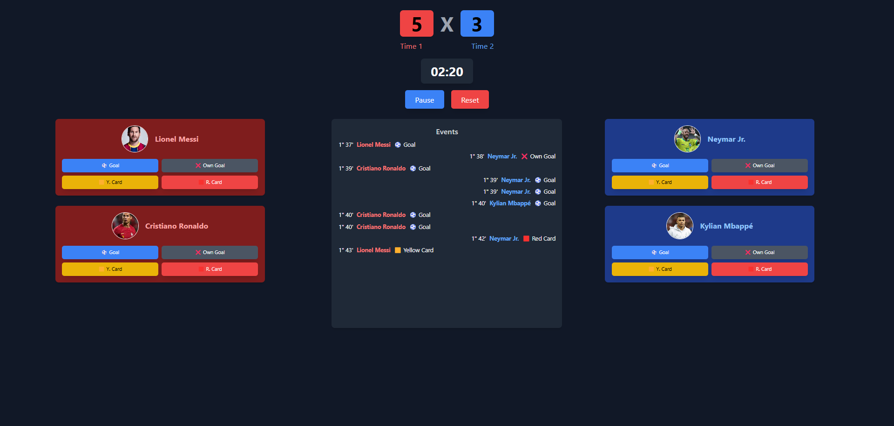

# 🏆 Score App - Electronic Scoreboard ⚽

The **Score App** is an electronic scoreboard application for football matches, developed with **React 19 + TypeScript** and styled with **TailwindCSS**. It allows tracking of **scores**, **match events** (goals, cards), and the **game timer**.

## 📌 Features
- 📊 **Real-time scoreboard**: Automatically updates based on match events.
- 🕒 **Integrated stopwatch**: Syncs events with match time.
- ⚽ **Event tracking**: Goals, own goals, yellow and red cards.
- 🏟️ **Player list**: Displays players from both teams with photos.

## 🚀 Technologies used
- **React 19** ⚛️
- **TypeScript**
- **TailwindCSS** 🎨
- **Vite** ⚡ (for fast development)
- **ESLint & Prettier** (code standardization)

## 🖼️ Imagens do projeto


## 📂 Project structure

```
score-app/
│── public/                # Public files (favicon, index.html, logos)
│── src/
│   ├── business/          # Business logic (score calculation, rules)
│   ├── components/        # React components
│   │   ├── MatchComponent/   # Main match screen
│   │   ├── PlayersListcomponent/   # Player and event listing
│   │   ├── ScoreboardComponent/    # Match scoreboard
│   │   ├── StopwatchComponent/     # Timer
│   │   ├── TimelineComponent/      # Event timeline
│   ├── types/             # TypeScript types (Match, Player, Event)
│   ├── utils/             # Helper functions (e.g., time formatting)
│── package.json           # Project dependencies
│── tailwind.config.js     # TailwindCSS configuration
│── tsconfig.json          # TypeScript configuration
│── vite.config.ts         # Vite configuration
```

## 🛠️ How to run the project?

### 1️⃣ **Prerequisites**
Before starting, make sure you have:
- **Node.js** installed (`v18+`)
- **Package manager**: `npm` or `yarn`

### 2️⃣ **Install dependencies**
```bash
npm install
# or
yarn install
```

### 3️⃣ **Run the project**
```bash
npm run dev
# or
yarn dev
```
Then, access: **http://localhost:5173**

## 🎯 Future improvements
- 🔄 Support for **pausing and resuming the stopwatch.**
- 📊 Display of detailed match statistics.
- 🌍 Integration with **API for live updates.**

## 🏆 Contribution
Feel free to contribute with suggestions, improvements, and new features!  

## 📜 License
This project is licensed under the **MIT License**.  